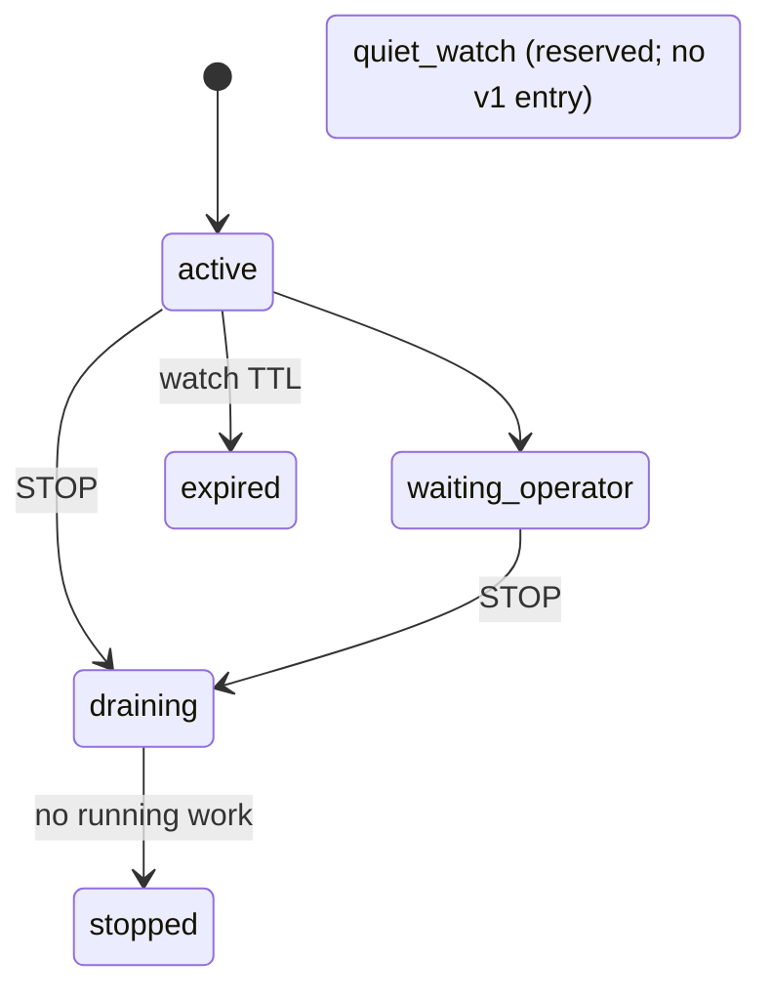
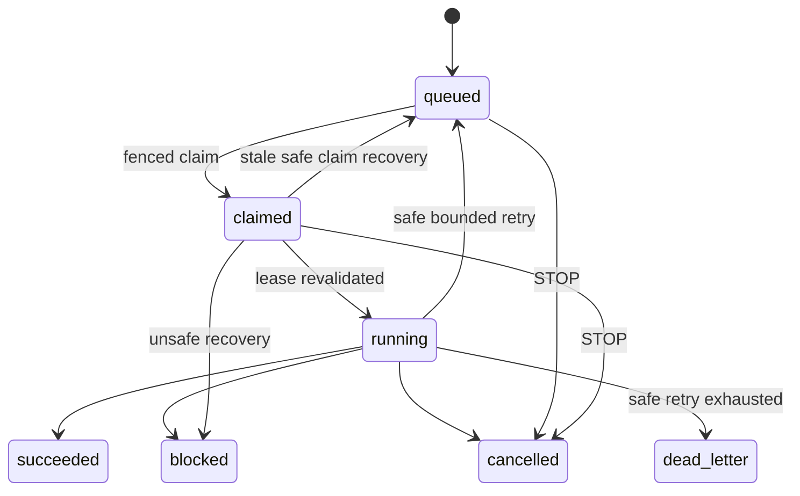

# CCCP Supervisor v1

## Status

This document is the canonical contract for the first deterministic CCCP
supervisor. It describes the local state machine and the safety boundary that
an agent adapter must satisfy.

The v1 implementation is intentionally local and inert by default:

- one Windows host;
- one project-local SQLite state store under `coop/.ccc/`;
- exactly one nonterminal run per `coop/` root because `STOP.md` is root-global;
- no live Claude or Codex call from the stock CLI; a later maintainer-owned
  profile binding and operator approval are both required;
- no cloud doorbell, inbound listener, or remote code execution;
- no UI automation by default.

The existing Markdown co-op files remain the human-readable collaboration
surface. They are not a distributed scheduler and do not replace the
supervisor state store.

## Goal and non-goals

The supervisor should make a bounded unit of agent work predictable:

1. accept a uniquely identified wake;
2. acquire a fenced lease for one agent;
3. claim one idempotent task;
4. run it through an explicitly configured adapter;
5. record a terminal result or a bounded retry;
6. honor STOP without starting more work;
7. leave a scrubbed audit trail.

V1 does not try to provide:

- a multi-host distributed queue;
- exactly-once effects in an external service;
- unattended production deployment;
- a general remote prompt endpoint;
- automatic control of an already running Codex Desktop process;
- a cloud copy of local prompts, results, corpus text, or private paths.

## Trust boundary

```text
same Windows host
  project/coop/
    Markdown protocol files       human collaboration surface
    .ccc/state.sqlite3            local lifecycle SSOT
    .ccc/payloads/                local task payloads
    .ccc/results/                 local result envelopes
  supervisor process              lease, claim, retry, STOP
  adapter child process           explicit and supervisor-owned only

future cloud doorbell
  opaque command metadata only
  local supervisor polls outward
  no prompt, prose, path, corpus, or result payload
```

`coop/.ccc/` is local-only. It may contain task or result text and must never be
committed, synchronized as a GitHub snapshot, or copied to Vercel, Supabase,
sooneeujuro.com, chat, or a coordination relay.

## Identities and durable records

Every boundary uses a distinct identifier. Do not substitute one for another.

| Identifier | Purpose |
| --- | --- |
| `run_id` | One supervisor run. UUID. |
| `generation` | Monotonic generation for a project alias. Fences stale runs. |
| `wake_id` | At-most-once receipt for one wake request. UUID. |
| `worker_session_id` | One local worker incarnation. UUID. |
| `lease_token` | Secret-like random token proving ownership of a lease. Local only. |
| `fence_epoch` | Monotonic lease epoch for one run and agent. |
| `task_id` | Durable task identity. UUID. |
| `idempotency_key` | Caller-supplied key unique within a run. |
| `correlation_id` | Groups a bounded handoff chain. UUID. |
| `conversation_id` | Adapter session or thread binding after confirmed success. |

An enqueue with an existing `idempotency_key` is a replay only when the target
agent, kind, effect class, and canonical payload hash all match. Any mismatch is
`idempotency_conflict`; it is never silently overwritten.

## Deterministic lifecycle

### Run states



Only `active` accepts or starts tasks through the v1 API. `quiet_watch` is a
reserved schema state with no v1 transition into it. A blocked or dead-letter
task moves the run to `waiting_operator`. `draining`, `stopped`, and `expired`
never start new work.

One `coop/` root is one execution namespace and may have only one nonterminal
run, regardless of project alias. This is enforced both before insert and by a
partial unique database index. The invariant makes `active_run_id()`
unambiguous and prevents the root-global `STOP.md` compatibility signal from
stopping an unrelated concurrent run. Parallel projects require separate
`coop/` roots.

### Task states



Every mutation revalidates the current lease token and fence epoch in the same
transaction. A stale worker receives a stable failure code and may not publish
a result.

### Leases

- At most one active lease exists per `(run_id, agent_id)`.
- Renewal requires the same worker session, lease token, fence epoch, and an
  unexpired lease.
- A replacement lease increments the fence epoch.
- Claims carry the worker session and fence epoch that created them.
- PID alone is never proof of worker ownership; process creation time,
  executable identity, and supervisor-owned job membership are also required
  by a process adapter.

### Effect classes and retry

| Effect class | Default attempts | Automatic retry |
| --- | ---: | --- |
| `read_only` | 3 | Only when the adapter marks the failure retryable. |
| `reversible` | 3 | Same, after the adapter confirms rollback or idempotency. |
| `mutating` | 1 | Never. Operator reconciliation required. |
| `external` | 1 | Never. Operator reconciliation required. |

Retries are finite. The current local store delays a safe retry by
`min(60, 2 ** attempt_count)` seconds. `max_attempts` is capped at 10. Watch
TTL, wake budget, handoff depth, handoffs per result, payload bytes, and output
bytes are also finite run-policy values.

Do not label an error retryable merely because it is inconvenient. Authentication,
permission, version, approval, idempotency, stale-generation, ambiguous session,
and selector failures require a human or a new explicit dispatch.

## Wake and handoff rules

- A wake is recorded before work starts.
- Duplicate `(run_id, agent_id, wake_id)` receipts do not launch a second worker.
- Timer wakes are rejected unless `auto_wake_allowed` is explicitly true.
- The per-agent wake budget is enforced before dispatch.
- A handoff creates a new task with a new idempotency key and the inherited
  correlation id.
- Handoff depth and number of handoffs per result are bounded.
- A handoff does not expand write scope, permission profile, or external-action
  authority.

## STOP is a state transition

`coop/STOP.md` remains the compatibility signal visible to humans and legacy
heartbeats. It is not merely advisory.

The normative sequence is:

1. record one stop request and move the run to `draining`;
2. atomically write the scrubbed `STOP.md` mirror;
3. reject new wakes, claims, and task starts;
4. cancel queued and claimed work;
5. signal active adapters to cancel and wait only for the configured grace
   period;
6. terminate only supervisor-owned process trees if graceful cancellation
   fails;
7. mark the run `stopped` after no work remains.

If a legacy actor writes `STOP.md` first, the next store transition imports it
as a stop request and enters `draining`. Starting a new run while a stale STOP
file exists fails closed. Removing STOP does not resume an old generation; the
operator starts a new run explicitly.

The state store mechanically handles the local transition and queued/claimed
cancellation. An adapter runner must implement cancellation of its own active
child; until that runner is enabled, v1 must not claim live-call support.

## Adapter contract

An adapter is an injected boundary, not an implicit shell command.

```text
probe()                           -> capability or stable failure
open_or_resume(turn_request)      -> turn handle
read_events(turn_handle)          -> bounded typed event stream
cancel(turn_handle, reason)       -> confirmed, unconfirmed, or rejected
reconcile(dispatch_receipt)       -> terminal, active, absent, or ambiguous
close()                           -> release owned resources
```

The request carries the wake id, agent id, generation, logical workspace id,
resolved local working directory, optional conversation binding, permission
profile id, timeouts, and byte/event caps. The audit record stores only safe
identifiers, counts, hashes, enums, and booleans—not raw prompts or output.

Those process receipts are required before a live production binding may be
enabled. The current v1 CLI intentionally has no live profile binding; it does
not claim that the full process-reconciliation receipt is deployed.

### Claude Code CLI

The implemented adapter/transport contract uses one non-interactive process
per turn:

- generate an explicit session UUID for the first call;
- use `--session-id` for the first turn and explicit `--resume <id>` later;
- never use ambiguous global `--continue`;
- send the prompt on stdin, not the process command line;
- send bounded text output and require exit code zero in the current adapter;
- use `permission-mode=plan`, an exact `Read,Glob,Grep` tool list, strict MCP,
  explicit empty settings, and an explicit working directory;
- terminate only the exact `Popen` child owned by the invocation;
- never pass a dangerous permission-bypass flag.

This is a transport building block, not a live CLI binding. A production
binding still requires a tested Windows Job Object or equivalent child-tree
ownership, pinned executable/version, project root binding, and structured
terminal-result parser. Until then the stock CLI returns
`live_adapter_profile_not_bound` even when its two consent flags are supplied.

Current defaults are 256 KiB input, 1 MiB stdout, and 64 KiB stderr. Both pipes
are drained concurrently. Reaching a cap terminates the owned child rather
than allowing deadlock or unbounded memory use.

### Codex app server

The supported integration shape is a separately launched, supervisor-owned
`codex app-server` using stdio JSONL. It must:

1. initialize the connection exactly once;
2. start or resume an explicit thread id;
3. use the stable local task id as `clientUserMessageId` for correlation;
4. keep a single active turn per supervised thread;
5. require `turn/completed` before publishing success;
6. request `turn/interrupt` on timeout and wait a bounded grace period;
7. reconcile a repeated wake by reading the thread and finding the echoed
   client id before sending anything again.

`clientUserMessageId` is correlation, not a server-side exactly-once guarantee.
The local dispatch ledger remains authoritative.

The default is `approvalPolicy=never` with a read-only sandbox/profile.
Named write profiles require capability discovery and an explicit allowlist.
Unexpected approval or permission requests are denied and surfaced as
`approval_required`; they are never auto-approved by an unattended client.

Do not attach to or kill an app server already owned by Codex Desktop. Do not
rely on experimental WebSocket transport. Background terminals are a separate
lifecycle from a turn; until a pinned and tested cleanup capability exists,
detecting one yields `background_terminal_unmanaged` and blocks promotion.

### Timeout and cancellation

Each adapter has a bounded timeout and cancellation grace period. Before any
live production binding, child-tree ownership must satisfy this target:

- Claude: graceful process-group interruption is best effort; the production
  hard stop should be termination of a supervisor-owned Job Object. The
  current tested transport owns and terminates one exact child only.
- Codex: call `turn/interrupt`, await the matching interrupted completion, then
  terminate only the owned app-server job if the protocol does not settle.
- A timeout never authorizes killing an app-owned or unrelated process.
- `cancel_unconfirmed` and `process_tree_kill_failed` require operator review.

## Windows UI nudge

UI nudge is disabled by default and is not an execution adapter. The safe
default action is a taskbar flash or local notification.

An optional one-shot UI Automation invocation may be implemented only when all
of the following are true:

- the operator enabled it for this run;
- a versioned selector manifest matches the signed package and app version;
- the exact root PID/window and logical target thread are bound;
- one and only one element matches an exact AutomationId, ControlType, and
  ancestor chain;
- the target app is already foreground;
- no text field, modal dialog, lock screen, disconnected desktop, or secure
  desktop is active.

It must not set focus, bring a window to the foreground, type, paste, use a
keyboard shortcut, move the pointer, use screen coordinates, use OCR, or click
a generic label. Selector drift fails closed.

The nudge id is written before invoking UIA. It is at-most-once, has a per-target
cooldown, and is never treated as evidence that an agent turn started or
finished. An unconfirmed nudge is not retried automatically.

## Audit and safe status

Local event details accept only small allowlisted keys and scrubbed scalar
values. The shareable status surface is limited to:

- schema and schema version;
- opaque run id and generation;
- an opaque random `project_ref`, never the operator-supplied local alias;
- run state and STOP/watch booleans;
- fixed task and wake counts;
- agent state, conversation-bound boolean, consecutive-failure count,
  failure-present boolean, and coarse allowlisted failure class.

It must not expose payload references, local filesystem paths, prompts,
assistant prose, command lines, stdout/stderr, credentials, corpus content,
sidecars, protected FGP text, or manuscript text.

## Future metadata-only doorbell

The possible sooneeujuro.com + Vercel + Supabase integration is a doorbell, not
a remote agent API. It is not part of same-host v1 and must remain off until a
separate deployment review.

The local supervisor opens no inbound port. It periodically makes an outbound
authenticated poll to one allowlisted HTTPS origin. The cloud side may hold
only strict metadata rows.

### Command allowlist

```json
{
  "$schema": "https://json-schema.org/draft/2020-12/schema",
  "$id": "ccc.doorbell.command.v1",
  "type": "object",
  "additionalProperties": false,
  "required": [
    "schema", "command_id", "project_id", "run_generation",
    "target_agent", "action", "issued_at", "expires_at", "nonce",
    "capability_id"
  ],
  "properties": {
    "schema": { "const": "ccc.doorbell.command.v1" },
    "command_id": { "type": "string", "format": "uuid" },
    "project_id": {
      "type": "string", "pattern": "^[A-Za-z0-9_-]{16,64}$"
    },
    "run_generation": { "type": "integer", "minimum": 1 },
    "target_agent": { "enum": ["claude", "codex"] },
    "action": { "enum": ["wake", "stop", "status_probe"] },
    "issued_at": { "type": "string", "format": "date-time" },
    "expires_at": { "type": "string", "format": "date-time" },
    "nonce": {
      "type": "string", "pattern": "^[A-Za-z0-9_-]{22,128}$"
    },
    "capability_id": {
      "type": "string", "pattern": "^[A-Za-z0-9_-]{16,64}$"
    }
  }
}
```

Unknown or additional keys fail validation. There is no prompt, free-text
instruction, URL, path, branch, command, attachment, or payload reference. A
`wake` only asks the local supervisor to inspect its already-authorized local
queue; it does not carry the work.

### Acknowledgement allowlist

```json
{
  "$schema": "https://json-schema.org/draft/2020-12/schema",
  "$id": "ccc.doorbell.ack.v1",
  "type": "object",
  "additionalProperties": false,
  "required": [
    "schema", "command_id", "project_id", "run_generation", "state",
    "failure_class", "observed_at"
  ],
  "properties": {
    "schema": { "const": "ccc.doorbell.ack.v1" },
    "command_id": { "type": "string", "format": "uuid" },
    "project_id": {
      "type": "string", "pattern": "^[A-Za-z0-9_-]{16,64}$"
    },
    "run_generation": { "type": "integer", "minimum": 1 },
    "state": {
      "enum": ["accepted", "suppressed", "completed", "failed"]
    },
    "failure_class": {
      "enum": [
        "none", "auth", "capability", "expiry", "replay",
        "generation", "run", "adapter", "lifecycle", "other"
      ]
    },
    "observed_at": { "type": "string", "format": "date-time" }
  }
}
```

Optional status publication uses the safe-status fields listed above and fixed
count maps only. It never includes a task summary.

The cloud schema and the local state store both validate project binding,
generation, action, expiry, replay id, capability, and allowlisted fields. A
short-lived project-scoped capability is preferred over a long-lived bearer
secret. `capability_id` is only a non-secret handle; the capability proof stays
in the authenticated transport, is stored only as a verifier/hash where
possible, and never enters a row, URL, response body, or log. The local receipt
is written before executing a command. Unknown,
expired, duplicated, unauthorized, or stale-generation commands are suppressed.

Policy validation additionally requires `expires_at` to be later than
`issued_at` but no more than five minutes later, a unique nonce, bounded clock
skew, and a capability scoped to the exact project and allowed actions. JSON
Schema `format` checks must be enabled rather than treated as annotations.

Vercel may serve the authenticated gateway and sanitized UI; Supabase may hold
authentication, opaque project membership, command metadata, receipts, and
safe status. Neither is a corpus, prompt store, manuscript store, result store,
nor general relay.

## Stable failure families

Adapters and the state store should return machine enums, with retryability as
a separate boolean. Important families are:

- configuration: `adapter_not_configured`, `executable_not_found`,
  `executable_not_invocable`, `version_unsupported`,
  `permission_profile_unknown`, `settings_hash_mismatch`;
- protocol/process: `process_start_failed`, `handshake_timeout`,
  `protocol_malformed`, `server_overloaded`, `stdout_limit_exceeded`,
  `terminal_event_missing`, `agent_exit_nonzero`;
- authority: `auth_required`, `permission_denied`, `approval_required`;
- identity: `idempotency_conflict`, `lease_fence_stale`,
  `stale_generation`, `session_state_ambiguous`;
- cancellation: `turn_timeout`, `cancel_unconfirmed`,
  `process_tree_kill_failed`, `background_terminal_unmanaged`;
- UI: `ui_disabled`, `ui_selector_missing`, `ui_selector_ambiguous`,
  `ui_focus_guard_blocked`, `ui_cooldown_active`,
  `ui_nudge_unconfirmed`.

Only explicitly transient network, rate-limit, overload, or process-start
failures receive bounded automatic retry. A repeated protocol failure or any
ambiguous effect stops for operator reconciliation.

## Same-host v1 limitations

- SQLite fencing protects cooperating workers on one host; it is not a
  distributed consensus system.
- The state directory must reside on the local project filesystem, not a NAS
  share or cloud-synchronized directory.
- A host power loss can leave an external service effect ambiguous even when
  local transactions are durable.
- The supervisor cannot prove exactly-once behavior inside Claude, Codex, Git,
  GitHub, or any other external system.
- Process-tree ownership requires a tested Windows Job Object runner; PID-only
  cleanup is insufficient.
- UIA invocation remains unavailable until selectors are captured and tested
  for a pinned app version.
- The future doorbell does not make a local adapter available, grant new
  permissions, or bypass a blocked corporate network.
- No current v1 claim should be described as deployed merely because its schema
  or design is documented.

## Verification gates

Before enabling a live adapter, tests must demonstrate:

1. duplicate wakes do not launch twice;
2. stale leases cannot start or finish tasks;
3. STOP prevents new work and drains boundedly;
4. only safe effect classes retry, within the attempt budget;
5. oversized payload/output is rejected or cancelled;
6. a crashed worker cannot publish through a replaced fence;
7. raw text and local paths do not enter safe status or event details;
8. mocked adapter timeout and cancellation leave no owned child;
9. unexpected approval requests fail closed;
10. UI selector ambiguity performs no action;
11. future doorbell schemas reject extra fields and protected payloads;
12. `.ccc/` remains untracked.
